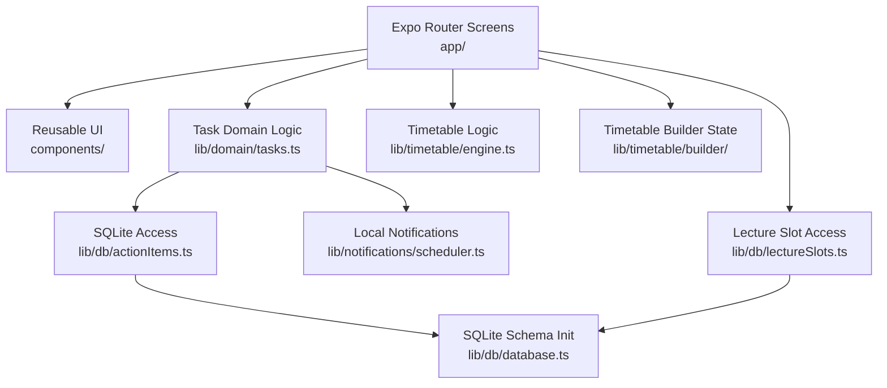

# PROJECT_CONTEXT.md

## System Goals

The current repository implements a student productivity app with these observable goals:

- capture tasks with optional dates, times, and notes
- separate tasks into actionable views based on scheduling state
- allow students to define and maintain a weekly college timetable
- surface the current lecture, next lecture, and today’s lecture schedule
- schedule local reminders for tasks that have a date

Out of scope in the current codebase:

- user accounts
- remote APIs
- data synchronization
- cloud persistence
- server-side processing

## Architecture Diagram

## Important Modules

### App bootstrap

- `app/_layout.tsx`
  - loads fonts
  - controls splash screen
  - configures theme
  - initializes SQLite through `SQLiteProvider`
  - configures notifications
  - mounts the root stack

### Navigation shell

- `app/(tabs)/_layout.tsx`
  - defines the four-tab shell:
    - `Now`
    - `Upcoming`
    - `Inbox`
    - `Timetable`

### Task screens

- `app/task/create.tsx`
  - task creation form
- `app/task/[id].tsx`
  - task detail, complete/incomplete toggle, delete
- `app/(tabs)/index.tsx`
  - today-oriented view for timed tasks and lecture context
- `app/(tabs)/upcoming.tsx`
  - grouped future/dated tasks
- `app/(tabs)/unscheduled.tsx`
  - inbox for undated tasks

### Timetable screens

- `app/(tabs)/timetable.tsx`
  - current, next, and full schedule for today
- `app/timetable/setup.tsx`
  - per-day lecture slot entry flow
- `app/timetable/create.tsx`
  - reducer-driven builder with presets and validation

### Persistence

- `lib/db/database.ts`
  - SQLite schema initialization
- `lib/db/actionItems.ts`
  - task CRUD and task query methods
- `lib/db/lectureSlots.ts`
  - lecture slot CRUD and bulk replacement

### Domain logic

- `lib/domain/tasks.ts`
  - task creation normalization
  - completion toggling
  - delete flow
  - notification reconciliation entry point

### Timetable engine

- `lib/timetable/engine.ts`
  - current lecture lookup
  - next lecture lookup
  - schedule sorting
  - time formatting helpers

### Timetable builder

- `lib/timetable/builder/reducer.ts`
- `lib/timetable/builder/validation.ts`
- `lib/timetable/builder/presets.ts`
- `lib/timetable/builder/types.ts`

These modules implement a deterministic reducer-based state machine for editing weekly timetables.

## Data Flow

### App startup

1. `app/_layout.tsx` loads fonts and prevents premature splash dismissal.
2. `SQLiteProvider` initializes the local database using `initializeDatabase`.
3. Notification configuration runs through `configureNotifications`.
4. The root Expo Router stack renders the tab shell and modal/detail screens.

### Task creation flow

1. User submits `app/task/create.tsx`.
2. Screen calls `createTask` in `lib/domain/tasks.ts`.
3. Domain logic normalizes the deadline intent into date/time fields.
4. `lib/db/actionItems.ts` inserts the task into SQLite.
5. `lib/notifications/scheduler.ts` schedules a notification if the task has a future date.
6. Notification id is persisted back to the task record when available.

### Task update flow

1. Task lists or detail screen trigger complete/incomplete changes.
2. `toggleTaskComplete` loads the current task from SQLite.
3. Completion status flips in storage.
4. Existing notifications are canceled or rescheduled based on the new state.

### Timetable flow

1. User edits timetable data in `app/timetable/setup.tsx` or `app/timetable/create.tsx`.
2. Screens transform UI input into `CreateLectureSlotInput`.
3. `lib/db/lectureSlots.ts` persists lecture slot records.
4. `app/(tabs)/timetable.tsx` reads the day’s slots.
5. `lib/timetable/engine.ts` derives current lecture, next lecture, and display order.

## Important Folders

- `app/`
- `components/`
- `components/timetable/`
- `lib/`
- `lib/db/`
- `lib/domain/`
- `lib/notifications/`
- `lib/timetable/`
- `lib/timetable/builder/`
- `assets/`

## Dependencies And Runtime

Key runtime dependencies inferred from `package.json`:

- `expo`
- `expo-router`
- `expo-sqlite`
- `expo-notifications`
- `expo-haptics`
- `@react-native-community/datetimepicker`
- `@expo/vector-icons`
- `react`
- `react-native`
- `react-native-reanimated`
- `react-native-safe-area-context`
- `react-native-screens`

Static typing and development:

- `typescript`
- `@types/react`
- `react-test-renderer`
